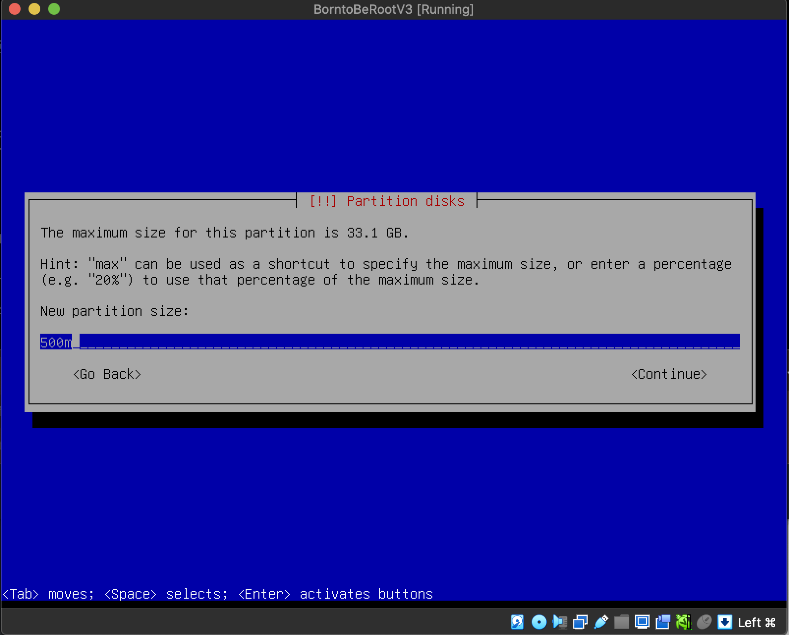

<div align="center">
	
	<h1>Born2beroot</h1>
</div>


$${\color{red}\text{If you found any mitakes, please pm or create a pull request!}}$$


> [!NOTE]
> To exit the virtual machine and return to your original machine, press the `control` key on Mac and right `ctrl` on Windows.

> [!TIP]
> To paste code from your machine to a virtual machine (VM), you can connect to the VM using Secure Shell (SSH).
> Once connected, you will be able to copy and paste text between your machine and the VM.

## Menu
* [Partitioning](#Partitioning)
* [SUDO](#SUDO)
* [UFW](#UFW)
* [Password policy](#Password-policy)
* [Signature](#Signature)
* [Questions you have to answer during evaluation](#Questions-you-have-to-answer-during-evaluation)
* [Evaluation sheet](#Evaluation-sheet)


## Partitioning

`You must choose as an operating system either the latest stable version of Debian (no testing/unstable), or the latest stable version of Rocky. Debian is highly recommended if you are new to system administration.`
In this example, we are going to use Debian because it's easier.

Download the `debian-xx.x.x-amd64-netinst.iso` file from [here](https://cdimage.debian.org/debian-cd/current/amd64/iso-cd/).


1. Create VM for your project inside the VirtualBox.

2. Name your VM anything you want, and for the `Folder`: field, select the `goinfre` folder. It will automatically choose your user's folder. You have to do this because every student gets 10GB of memory on the server, and the goinfre folder uses local memory, which is necessary as we require more than 10GB. Leave `ISO Image` empty.<br

3. Select 1GB of RAM (it should be enough)

4. Select 30.8 GB for the simple BONUS part where we are going to set up partitions, and leave the VDI as the hard disk type. And press `Finish`.

5. Settings -> Storage -> Controller (Empty) -> Optical drive -> Choose a disk file... Then select the debian.iso file you just downloaded and press OK.

6. After all that, you can finally start your virtual machine. You should also change the display size if you want to see anything.

7. Select "Install".

8. Select your language.

9. Select your location. If your location is not here, just select `other`, the continent and you will find it!

10. This instruction is from subject.pdf file, so name your hostname accordingly.<br>
`The hostname of your virtual machine must be your login ending with 42 (e.g., wil42). You will have to modify this hostname during your evaluation.`

11. Skip the domain name.

12. Choose your root password. Write it down, you will need it later!

13. Re-enter your password.

14. Now, you need to create an additional user, as suggested in the subject.pdf. This user should have the same username as your intra username, but this time without adding 42, unlike what we did with the hostname.<br>
`In addition to the root user, a user with your login as username has to be present.`

15. Create a password for the user you are setting up. For simplicity, you can use the same password as you did for the root.

16. Re-enter the password.

17. Select the partition.

18. Select `Yes`.

19. Select `FREE SPACE` to configurate.

20. Create a new partition.

21. First you have to create primary partition for boot.

22. Select `Primary`.

23. Select `Beggining`.

24. Select `Mount point`. "Use as: Ext4 journaling file system" should be automatically selected.

25. Select `/boot`.

26. Select `Done setting up the partition.`

27. Select `Create a new partition`

28. Write `max`. So you are taking all availabe space left and you will be creating encrypted partition later.

29. Select `Logical`.

30. Select `Mount point`.

31. Select `Do not mount it`.

32. Select `Done setting up the partition`.

33. Select `Configure encrypted volumes`.

34. Select `Yes`.

35. Select `Create encrypteed volumes`.

36. Select the second partition `/dev/sda5` and click `ENTER`. First you have to ecrypt the partision and later we gonna partision the ecrypted drive like in the example of the bonus part.

37. Click `Yes` to confirm it.

38. Remeber this passphrase as you will need to use it every time you run your VM! Best advice would be to write it down.

39. Confirm your passphrase.

40. Select `Configure the Logical Volume Manager`.

41. Select `Yes`.

42. Select `Create Volume group`.

43. Write LVMGroup (like in the bonus example part).

44. Select `Create logical volume`.

45. Select the "Volume group" we just created `LVMGroup`.

46. First you should create volume root. So write `root` down.

47. Set root to be `10G`.

48. Select `Create logical volume`.

49. Select `LVMGroup`.

50. Next volume you have to create is swap. So write `swap` down.

51. Set swap to be `2.3G`.

52. Select `Create logical volume`.

53. Select `LVMGroup`.

54. Next volume you have to create is home. So write `home` down.

55. Set home to be `5G`.

56. Select `Create logical volume`.

57. Select `LVMGroup`.

58. Next volume you have to create is var. So write `var` down.

59. Set var to be `3G`.

60. Select `Create logical volume`.

61. Select `LVMGroup`.

62. Next volume you have to create is srv. So write `srv` down.

63. Set srv to be `3G`.

64. Select `Create logical volume`.

65. Select `LVMGroup`.

66. Next volume you have to create is tmp. So write `tmp` down.

67. Set tmp to be `3G`.

68. Select `Create logical volume`.

69. Select `LVMGroup`.

70. Next volume you have to create is var-log. So write `var-log` down.

71. Set var-log to be `4G`.

72. Select `Finish`

73. First you have to configure `home` partition. Select it.

74. Select `Use as:`

75. Select `Ext4 journaling file system`.

76. Select `Mount point:`.

77. Select `/home`.

78. Select `Done setting up the partition`.

79. Now you have to set up `root`. Select it

80. Select `Use as:`.

81. Select `Ext4 journaling file system`.

82. Select `Mount point:`

83. Select the first option `/ - the root file system`.

84. Select `Done setting up the partition`.

85. Now you need to configurate `srv`. Select it.

86. Select `Use as:`.

87. Select `Ext4 journaling file system`.

88. Select `Mount point:`.

89. Select `/srv`

90. Select `Done setting up the partition`.

91. Now you need to configurate `swap`. Select it.

92. Select `Use as:`.

93. Select `swap area`.

94. Select `Done setting up the partition`.

95. Now you need to configurate `tmp`. Select it.

96. Select `Use as:`.

97. Select `Ext4 journaling file system`.

98. Select `Mount point:`.

99. Select `/tmp`.

100. Select `Done setting up the partition`.

101. Now you need to configurate `var`. Select it.

102. Select `Use as:`.

103. Select `Ext4 journaling file system`.

104. Select `Mount point:`.

105. Select `/var`

106. Select `Done setting up the partition`.

107. Now you need to configurate `var-log`. Select it.

108. Select `Use as:`.

109. Select `Ext4 journaling file system`.

110. Select `Mount point:`.

111. Select `Enter manually`.

112. Write `/var/log`

113. Select `Done setting up the partition`.

114. Select `Yes`.

115. Select `No`.

116. Select region that is close to you.

117. Select deb.debian.org

118. Leave it empty and select `Continue`.

119. Select `No`.

120. Deselect everything and press `Continue`

121. Select `Yes`

122. Here you have to install GRUB boot loader. Select available drive.

123. Select `Continue` to finish the installation.

124. Log in to the machine and write the command: `lsblk`. Partition size is not indentical, but we don't care about size, we only care about the structure.


# ⚙️ Configurations

## SUDO

1. Type `su -` to log in as root user. You will be asked to provide root password. If you were successful your username name will be changed to `root@your_host_name`.
2. Type `apt-get update`.
	<details>
	<summary>What is "<em>apt-get update</em>"?</summary>

	> <em>This command refreshes the local package index, which is essentially a catalog of available software packages. It fetches the latest information about the versions of packages available in the repositories. However, it doesn't make any changes to the actual software on your system.</em><br>
	</details>
3. Type `apt-get upgrade -y` (-y flag means, that you confirm, that additional disk space will be used to install the upgrades).
	<details>
	<summary>What is "<em>apt-get upgrade</em>"?</summary>

	> <em>This command, when executed after apt-get update, looks at the local package index to determine if there are newer versions of the packages currently installed on your system. If it finds newer versions, it then downloads and installs those updates. The upgrade process ensures that your installed software is brought up to the latest available versions.</em>
4. To install sudo, type `apt install sudo`
	<details>
	<summary>What is "<em>sudo</em>"?</summary>

	> <em>`sudo` is a tool on your computer that grants you temporary superpowers for specific tasks. It's like having a key to unlock special doors when needed. When you use `sudo`, you're saying, "I need to do something important, and I have permission." Imagine it as having a special key that fits only one lock—the door to that particular task. Once you've completed that task, the temporary key disappears, ensuring that regular users can't accidentally or intentionally make big changes. These permissions are defined in a rule book called "/etc/sudoers." By default, the first person who sets up the computer has these permissions, and others can be given them later. So, `sudo` is a security measure, akin to having a special key that opens certain doors only when necessary, and only for those who should have access.</em>
	</details>

5. Type `usermod -aG sudo your_username`.

	<details>
	<summary>What is "<em>usermod</em>"?</summary>

	> <em> `usermod` is the tool used to modify user account properties. The `-aG` flags are options for "append" and "groups," indicating that we want to add the user to additional groups without removing them from existing ones. In this case, we are adding the user to the `sudo` group, which is typically associated with administrative or superuser privileges. Replace `your_username` with the actual username of the user you want to grant these privileges to. This command effectively empowers the specified user to perform administrative tasks using the `sudo` command. It's a concise way to enhance a user's access and control on the system.</em>
	</details>

6. To check if it worked, type `getent group sudo`. Your user should be in the list.

	<details>
	<summary>What is "<em>getent</em>"?</summary>

	> `getent` means "get entries", so `getent group sudo` means, get information about the group named `sudo`.
	</details>


7. Now we have to add our user to sudoesrs file, so it could use sudo. The safe and correct way to do it is to use `visudo` command. Just type in the terminal `visudo`. Scroll down and after "#User privilege specification" add your user with all privilages

	

	- When you do, press "control + x <em>(or ctrl + x on windows)</em>", then press "y" and then press "Enter" to save it.

	<details>
	<summary>What is "<em>var1=(var2:var3) var4</em> aka ALL=(ALL:ALL) ALL"?</summary>
	<br>

	`var1` This part specifies from where the user is allowed to execute commands with sudo.
	- Examples:
		- <b>localhost</b>: Allows the user to run commands with sudo only on the local machine.<br>
		`your_username localhost=(ALL:ALL) ALL`<br>
		- <b>IP Address (e.g., 192.168.0.1)</b>: Allows the user to run commands with sudo only from the machine with the specified IP address.<br>
		`your_username 192.168.0.1=(ALL:ALL) ALL`<br>
		- Hostname from the Same Network (e.g., <b>myserver</b>): Allows the user to run commands with sudo only from the machine with the specified hostname on the same network.<br>
		`your_username myserver=(ALL:ALL) ALL`<br>
		- Specific Network (e.g., <b>192.168.0.0/24</b>): Allows the user to run commands with sudo only from machines in the specified network range.<br>
		`your_username 192.168.0.0/24=(ALL:ALL) ALL`<br>
		- Any Host (using <b>ALL</b>): Allows the user to run commands with sudo from any host.<br>
		`your_username ALL=(ALL:ALL) ALL`<br>
		<br>

	`(var2:var3)` (Run As User:Run As Group): This part specifies which user and group the allowed commands can be run as.
	- Examples:
		- <b>(ALL:ALL)</b>: Allows the user to run commands with sudo as any user and any group.<br>
		`user1 ALL=(ALL:ALL) ALL`<br>
		- <b>(john:admin)</b>: Allows the user to run commands with sudo as the user "john" and the group "admin."
		`alice ALL=(john:admin) ALL`<br>
		- <b>(:www-data):</b> Allows the user to run commands with sudo with the group set to "www-data," but as any user.<br>
		`bob ALL=(:www-data) ALL`<br>
		- <b>(ALL:admin)</b>: Allows the user to run commands with sudo as any user but with the group set to "admin."<br>
		`charlie ALL=(ALL:admin) ALL`<br>
		<b>( : )</b>: Allows the user to run commands with sudo without specifying a particular user or group.<br>
		`user2 ALL=(:) ALL`<br>
		<br>

	`var4` This part specifies the commands or operations the user is allowed to run with sudo.
	- Examples:
		- <b>/usr/bin/apt-get</b>: Allows the user to run only the apt-get command with sudo.<br>
		`bob ALL=(ALL:ALL) /usr/bin/apt-get`<br>
		- <b>/bin/ls:</b> Allows the user to run only the ls command with sudo.<br>
		`alice ALL=(ALL:ALL) /bin/ls`<br>
		- <b>/sbin/reboot</b>: Allows the user to run only the reboot command with sudo.<br>
		`charlie ALL=(ALL:ALL) /sbin/reboot`<br>
		- <b>/bin/chown, /usr/bin/apt-get</b>: Specifies that John can run the chown command and the apt-get command with sudo.<br>
		`john ALL=(root:admin) /bin/chown, /usr/bin/apt-get`<br>
	</details>

8. Also, we need to add strong configuration for your sudo group. Type `sudo nano /etc/sudoers` to open sudoers file. Add the following code like in example:

```
	Defaults        env_reset
	Defaults        mail_badpass
	Defaults        secure_path="/usr/local/sbin:/usr/local/bin:/usr/sbin:/usr/bin:/sbin:/bin"
	Defaults        badpass_message="Wrong password, please try again!"
	Defaults        passwd_tries=3
	Defaults        logfile="/var/log/sudo/sudo.log"
	Defaults        log_input, log_output
	Defaults        requiretty
```


## SSH

1. Type `sudo apt install openssh-server` to enable SSH on the server. Enter your password if asked (you will be asked a passoword, if you not not logged in as root), when prompted, then press `y` to continue the installation.

2. Type `sudo systemctl status ssh` to confirm, that SSH service is running.

	
3. Type `sudo nano /etc/ssh/sshd_config` to edit the port we gonna use for SSH.
4. Change `#Port 22` to `Port 4242`.
	
	
5. Press `command + x` (or `ctrl + x` on windows) then press `y` and then `enter` to save it.
6. Now we need to restart the SSH service so our changes take effect. Type `sudo service ssh restart`.
7. Type `sudo systemctl status ssh` to see, that everything is correct and we are running on port 4242.

	
8. If the port did not change, start again from step 2.
9. Now we need open the `4242` port on VM. So turn off the server and click Settings -> Network -> Port Forwarding.

	
10. Click the screen button "New rule" and change `Host Port` and `Guest Port` to `4242`.

	

11. When you done, save your changes and start the server again. Type `sudo service sshd status` to check if SSH service ir running.

12. Open iTerm terminal (a normal terminal did not work for me) on your main machine and type `ssh your_username@127.0.0.1 -p 4242` or `ssh your_username@localhost -p 4242` to connect to your server via SSH.

## UFW

1. As per pdf documment provided, we have to install UFW. For this, type:<br> `sudo apt-get install ufw -y`

	<details>
	<summary>What is "<em><b>UFW</b></em>"?</summary>

	> `UFW` <em>(Uncomplicated Firewall)</em> is a firewall management tool for Linux. It is not a standalone firewall but rather a user-friendly interface that simplifies the process of configuring and managing the underlying netfilter firewall, which is part of the Linux kernel.<br>
	With UFW, users can easily define rules to allow or deny specific types of network traffic, such as allowing traffic on certain ports or blocking traffic from specific IP addresses. UFW translates these user-configured rules into the format understood by the netfilter firewall, making it more accessible for users who may not be familiar with the intricacies of manual firewall configurations using the command line.<br>
	So, in essence, UFW acts as a convenient layer on top of the Linux netfilter firewall, providing an easier way for users to interact with and control their system's firewall settings.
	</details>

2. Type `sudo ufw enable` to active UFW.<br><br>
	
3. Type `sudo ufw status` to check status of the UFW.<br><br>
	
4. Now we have to allow incoming connections to SSH service throught the firewall. Type `sudo ufw allow ssh`<br><br>
	
5. We also need to open 4242 port, as per subject instructions. Type `sudo ufw allow 4242`<br><br>
	
6. Type `sudo ufw status` to check the opened ports.
	

## Password policy

Requirements from the subject:

* Password has to expire every 30 days.
* After changing the password, users are required to wait for a minimum of 2 days before making any further modifications.
* The user has to receive a warning message 7 days before their password expires.
* The password must be 10 characters long and include at least one uppercase letter, one lowercase letter, and one number. Additionally, it must not contain more than 3 consecutive identical characters.
* The password must not include the name of the user.
* The following rule does not apply to the root password: The password must have
at least 7 characters that are not part of the former password.
* Your root password has to comply with this policy.

For the first 3, we have to modify the `sudo nano /etc/login.defs`.

Change the Password aging controls:<br>
`PASS_MAX_DAYS - 30` (Maximum number of days a passowrd may be used.)<br>
`PASS_MIN_DAYS - 2` (Minimum number of days allowed between passowrd changes.)<br>
`PASS_WARN_AGE - 7` (Number of days warning given before a pasword expires.)<br>
`sudo reboot` to save changes.<br>

For other requrements we are using [pam_pwquality](https://manpages.debian.org/testing/libpam-pwquality/pam_pwquality.8.en.html).<br>
1. First install: `sudo apt-get install libpam-pwquality`<br>
2. We need to change settings in the settings file. Type: `sudo nano /etc/pam.d/common-password`<br>
Line to eddit: `password 			requisite					pam_pwquality.so retry=3`<br>
Change to: `password requisite pam_pwquality.so retry=3 minlen=10 ucredit=-1 dcredit=-1 lcredit=-1 maxrepeat=3 difok=7 enforce_for_root`<br>

<details>
<summary>What is "<em><b>minlen</b></em>"?</summary>

> `minlen=N` - The minimum acceptable size for the new password (plus one if credits are not disabled which is the default). In addition to the number of characters in the new password, credit (of +1 in length) is given for each different kind of character (other, upper, lower and digit). The default for this parameter is 9 . Note that there is a pair of length limits also in Cracklib, which is used for dictionary checking, a "way too short" limit of 4 which is hard coded in and a build time defined limit (6) that will be checked without reference to minlen.
</details>

<details>
<summary>What is "<em><b>dcredit</b></em>"?</summary>

> `dcredit=N` - (N >= 0) This is the maximum credit for having digits in the new password. If you have less than or N digits, each digit will count +1 towards meeting the current minlen value. The default for dcredit is 1 which is the recommended value for minlen less than 10.<br>
(N < 0) This is the minimum number of digits that must be met for a new password.
</details>

<details>
<summary>What is "<em><b>ucredit</b></em>"?</summary>

> `ucredit=N` - (N >= 0) This is the maximum credit for having upper case letters in the new password. If you have less than or N upper case letters each letter will count +1 towards meeting the current minlen value. The default for ucredit is 1 which is the recommended value for minlen less than 10.<br>
(N < 0) This is the minimum number of upper case letters that must be met for a new password.
</details>

<details>
<summary>What is "<em><b>lcredit</b></em>"?</summary>

> `lcredit=N` - (N >= 0) This is the maximum credit for having lower case letters in the new password. If you have less than or N lower case letters, each letter will count +1 towards meeting the current minlen value. The default for lcredit is 1 which is the recommended value for minlen less than 10.<br>
(N < 0) This is the minimum number of lower case letters that must be met for a new password.
</details>

<details>
<summary>What is "<em><b>maxrepeat</b></em>"?</summary>

> `maxrepeat=N` - Reject passwords which contain more than N same consecutive characters. The default is 0 which means that this check is disabled.
</details>

<details>
<summary>What is "<em><b>difok</b></em>"?</summary>

> `difok=N` - This argument will change the default of 5 for the number of changes in the new password from the old password.
</details>

<details>
<summary>What is "<em><b>enforce_for_root</b></em>"?</summary>

> `enforce_for_root` - The module will return error on failed check even if the user changing the password is root. This option is off by default which means that just the message about the failed check is printed but root can change the password anyway.
</details>

> [!CAUTION]
> For users you created before, you need to change the password policy manualy!

To do that, type `chage -M 30 -I 2 -W 7 root` and `chage -M 30 -I 2 -W 7 your_intra_username`

To check if user have correct password policies, type: `chage -l username`.

## CRON and SCRIPT

Is hard to explain, what every script does, so you have to figure it out this part yourself. You can use this as a reference or you can use it to understand, how we got the results we want.

```
#!/bin/bash
arc=$(uname -a)
pcpu=$(grep "physical id" /proc/cpuinfo | sort | uniq | wc -l)
vcpu=$(grep "^processor" /proc/cpuinfo | wc -l)
fram=$(free -m | awk '$1 == "Mem:" {print $2}')
uram=$(free -m | awk '$1 == "Mem:" {print $3}')
pram=$(free | awk '/^Mem:/ {printf "%.2f", $3/$2*100}')
fdisk=$(df -BG | grep '^/dev/' | grep -v '/boot$' | awk '{ft += $2} END {print ft}')
udisk=$(df -BM | grep '^/dev/' | grep -v '/boot$' | awk '{ut += $3} END {print ut}')
pdisk=$(df -BM | grep '^/dev/' | grep -v '/boot$' | awk '{ut += $3} {ft+= $2} END {printf("%d"), ut/ft*100}')
cpul=$(top -bn1 | grep '^%Cpu' | cut -c 9- | tr -cd '[:digit:].[:space:]' | awk '{printf("%.1f"), 100.0-$4}')
lb=$(who -b | awk '$1 == "system" {print $3 " " $4}')
lvmu=$(if [ $(lsblk | grep "lvm" | wc -l) -eq 0 ]; then echo no; else echo yes; fi)
conn=$(($(ss -t | wc -l)-1))
ulog=$(who | cut -d ' ' -f1 | sort -u | wc -l)
ip=$(hostname -I)
mac=$(ip link show | grep "ether" | awk '{print $2}')
cmds=$(journalctl _COMM=sudo | grep COMMAND | wc -l)
wall "  #Architecture: $arc
        #CPU physical: $pcpu
        #vCPU: $vcpu
        #Memory Usage: $uram/${fram}MB ($pram%)
        #Disk Usage: $udisk/${fdisk}Gb ($pdisk%)
        #CPU load: $cpul%
        #Last boot: $lb
        #LVM use: $lvmu
        #Connections TCP: $conn ESTABLISHED
        #User log: $ulog
        #Network: IP $ip ($mac)
        #Sudo: $cmds cmd"
```

## Signature

1. The only thing you have to upload is `signature.txt` file. In that file, we need to put our server signature, to do that, go to your server folder, where you installed the server, it should be something like: `~/goinfre/your_server_name/your_server_name.vdi`, and type `shasum your_server_name.vdi`


## Questions you have to answer during evaluation:
 - How a virtual machine works.
 	- A virtual machine (VM) is like a computer simulator. It's software that acts as a copycat of a physical computer, allowing you to run multiple operating systems on a single actual computer. The main idea is to hide the details of the computer's hardware and create a separate space where different operating systems can do their thing without interfering with each other. What's neat is that you can also decide how much of the computer's resources (like processing power and memory) you want to assign to each virtual machine.
 - Their choice of operating system.
	- You can simply say that you chose Debian because, in the subject, it was mentioned to be easier.
 - The basic differences between Rocky and Debian.
	- Debian, known for its stability and expansive software repositories (meaning, that Debian has a lot of different programs and apps ready for you to use. It's like a big collection of tools and software that you can easily get and install on your computer when you need them. So, Debian is like a treasure chest full of programs you can choose from for whatever you want to do on your computer.), is a versatile operating system with a strong community and a rich history. It offers a wide range of applications and packages, making it suitable for various computing needs. Debian's reputation for reliability and its open-source nature contribute to its popularity among users seeking a dependable and flexible operating system. In contrast, Rocky Linux serves as a free, open-source substitute for Red Hat Enterprise Linux, emphasizing stability and security for enterprise use. The significance of Red Hat compatibility lies in the fact that many businesses rely on applications and standards specifically designed for Red Hat systems. Choosing Rocky Linux provides a cost-effective way for organizations to maintain compatibility with Red Hat without the associated expenses, making it a practical choice for businesses with a Red Hat-oriented IT environment.
 - The purpose of virtual machines.
	- A virtual machine is like a computer inside your computer. It helps you do different things on your computer by creating a special space. This space acts like a separate computer, running its own programs and system. The main idea is to let you use various software or even different operating systems on one computer. For example, you can have a Windows virtual machine on a computer that mostly uses Linux. It's like having different computers in one, making things more flexible and letting you use diverse software without any problems.
 - If the evaluated student chose Debian: the difference between aptitude and apt, and what APPArmor is.
	- In Debian Linux, both Aptitude and Apt serve as tools for managing software packages, helping with tasks like installing, upgrading, and removing programs. Aptitude stands out with its text-based interface and advanced features that handle package dependencies and conflicts. On the other hand, Apt, short for "Advanced Package Tool," is a command-line tool known for its user-friendly approach to package management, making tasks like resolving dependencies straightforward. Apt, considered more accessible than its predecessor apt-get, efficiently automates package management for Debian-based systems while offering simplicity in its design.
	- AppArmor acts as a permissions and access control tool specifically designed for programs or applications on a Linux system. It defines and enforces policies that dictate what resources (like files, directories, and network services) a particular program is allowed to access and what operations it can perform. By setting up these security profiles, AppArmor helps to minimize the potential damage that could occur if a program were compromised or if it unintentionally tries to access or modify sensitive parts of the system. It's an additional layer of security that complements other security measures on a Linux system. Essentially, AppArmor enhances the control over the actions of individual programs, contributing to overall system security.
 - The student being evaluated must first explain the value and operation of sudo using examples of their choice.
	- sudo is a command-line tool that acts as a privilege escalation tool in Unix-like operating systems, including Linux. If your user is part of the sudo group and is listed in the sudoers file, you can use sudo to perform administrative tasks or tasks that require elevated privileges. Typical administrative tasks include updating the system, installing or removing software, modifying system configurations, and other actions that regular users don't have permission to do by default. The use of sudo helps maintain security by allowing specific users to temporarily gain superuser privileges for authorized actions, without having to log in as the root user all the time.
	- Logging in as the root user is discouraged because it grants unrestricted access and control over the entire system. When logged in as root, any command or action, intentional or accidental, can significantly impact the stability and security of the system. It increases the risk of making critical mistakes, such as deleting essential system files or installing malicious software without any barriers. The principle of least privilege recommends avoiding constant root access and instead using tools like sudo to grant elevated privileges only when necessary, promoting a more controlled and secure computing environment.
 - The student being evaluated must be able to explain to you basically what SSH is and the value of using it.
	-


# Evaluation sheet

## General instructions
- During the defense, as soon as you need help to verify a point, the student evaluated must help you.
- Ensure that the "signature.txt" file is present at the root of the cloned repository.
- Check that the signature contained in "signature.txt" is identical to that of the ".vdi" file of the virtual machine to be evaluated.
- A simple "diff" should allow you to compare the two signatures. If necessary, ask the student being evaluated where their ".vdi" file is located.
- As a precaution, you can duplicate the initial virtual machine in order to keep a copy.
- Start the virtual machine to be evaluated.

## Project overview
- The student being evaluated should explain to you simply:
- How a virtual machine works.
- Their choice of operating system.
- The basic differences between Rocky and Debian.
- The purpose of virtual machines.
- If the evaluated student chose Rocky: what SELinux and DNF are.
- If the evaluated student chose Debian: the difference between aptitude and apt, and what APPArmor is. During the defense, a script must display information all every 10 minutes. Its operation will be checked in detail later.

## Simple setup
- Ensure that the machine does not have a graphical environment at launch. A password will be requested before attempting to connect to this machine. Finally, connect with a user with the help of the student being evaluated. This user must not be root.
Pay attention to the password chosen, it must follow the rules imposed in the subject.
- Check that the UFW service is started with the help of the evaluator.
- Check that the SSH service is started with the help of the evaluator.
- Check that the chosen operating system is Debian or Rocky with the help of the evaluator.

## User
- The subject requests that a user with the login of the student being evaluated is present on the virtual machine. Check that it has been added and that it belongs to the "sudo" and "user42" groups.
- Make sure the rules imposed in the subject concerning the password policy have been put in place by following the following steps.
- First, create a new user. Assign it a password of your choice, respecting the subject rules. The student being evaluated must now explain to you how they were able to set up the rules requested in the subject on their virtual machine.
- Normally there should be one or two modified files. If there is any problem, the evaluation stops here.
- Now that you have a new user, ask the student being evaluated to create a group named "evaluating" in front of you and assign it to this user. Finally, check that this user belongs to the "evaluating" group.
- Finally, ask the student being evaluated to explain the advantages of this password policy, as well as the advantages and disadvantages of its implementation. Of course, answering that it is because the subject asks for it does not count.

## Hostname and partitions
- Check that the hostname of the machine is correctly formatted as follows: login42 (login of the student being evaluated).
- Modify this hostname by replacing the login with yours, then restart the machine. If on restart, the hostname has not been updated, the evaluation stops here.
- You can now restore the machine to the original hostname.
- Ask the student being evaluated how to view the partitions for this virtual machine.
- Compare the output with the example given in the subject. Please note: if the student evaluated makes the bonuses, it will be necessary to refer to the bonus example.
- This part is an opportunity to discuss the scores! The student being evaluated should give you a brief explanation of how LVM works and what it is all about.

## SUDO
- Check that the "sudo" program is properly installed on the virtual machine.
- The student being evaluated should now show assigning your new user to the "sudo" group.
- The subject imposes strict rules for sudo. The student being evaluated must first explain the value and operation of sudo using examples of their choice. In a second step, it must show you the implementation of the rules imposed by the subject.
- Verify that the "/var/log/sudo/" folder exists and has at least one file. Check the contents of the files in this folder, You should see a history of the commands used with sudo. Finally, try to run a command via sudo. See if the file (s) in the "/var/log/sudo/" folder have been updated.

## UFW / Firewalld
- Check that the "UFW" (or "Firewalld" for rocky) program is properly installed on the virtual machine.
- Check that it is working properly.
- The student being evaluated should explain to you basically what UFW (or Firewalld) is and the value of using it.
- List the active rules in UFW (or Firewalld). A rule must exist for port 4242.
- Add a new rule to open port 8080. Check that this one has been added by listing the active rules.
- Finally, delete this new rule with the help of the student being evaluated.

## SSH
- Check that the SSH service is properly installed on the virtual machine.
- Check that it is working properly.
- The student being evaluated must be able to explain to you basically what SSH is and the value of using it.
- Verify that the SSH service only uses port 4242.
- The student being evaluated should help you use SSH in order to log in with the newly created user. To do this, you can use a key or a simple password. It will depend on the student being evaluated. Of course, you have to make sure that you cannot use SSH with the "root" user as stated in the subject.

## Script monitoring
The student being evaluated should explain to you simply:
- How their script works by showing you the code.
- What "cron" is.
- How the student being evaluated set up their script so that it runs every 10 minutes from when the server starts. Once the correct functioning of the script has been verified, the student being evaluated should ensure that this script runs every minute.
You can run whatever you want to make sure the script runs with dynamic values correctly. Finally, the student being evaluated should make the script stop running when the server has started up, but without modifying the script itself. To check this point, you will have to restart the server one last time. At startup, it will be necessary to check that the script still exists in the same place, that its rights have remained unchanged, and that it has not been modified.

## Bonus
Check, with the help of the subject and the student being evaluated, the bonus points authorized for this project:
- Setting up partitions is worth 2 points.
- Setting up WordPress, only with the services required by the subject, is worth 2 points.
= The free choice service is worth 1 point. Verify and test the proper functioning and implementation of each extra service. For the free choice service, the student being evaluated has to give you a simple explanation about how it works and why they think it is useful. Please note that NGINX and Apache2 are prohibited.
