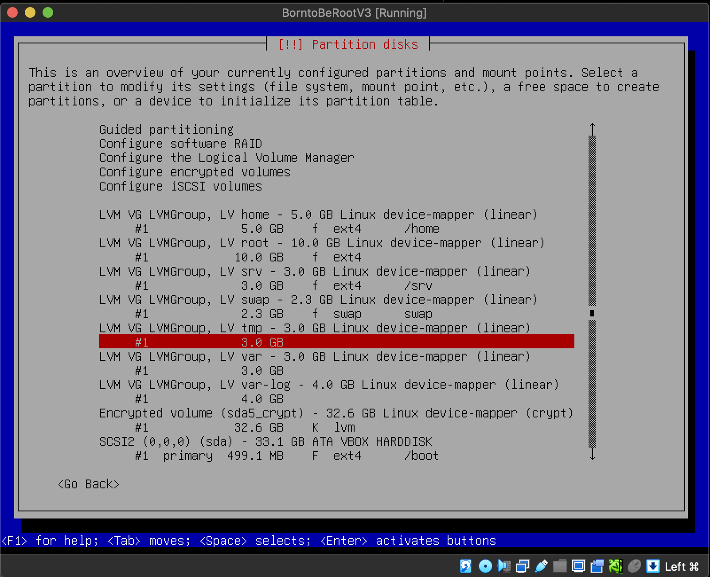
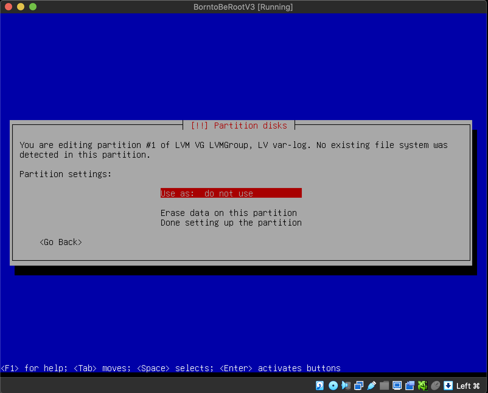

#  Born2beroot

$${\color{red}\text{Note: This guide was created using a Mac!}}$$

## Mandatory part

`You must choose as an operating system either the latest stable version of Debian (no testing/unstable), or the latest stable version of Rocky. Debian is highly recommended if you are new to system administration.`
In this example, we are going to use Debian because it's easier.

Download the `debian-xx.x.x-amd64-netinst.iso` file from [here](https://cdimage.debian.org/debian-cd/current/amd64/iso-cd/).

1. Create VM for your project inside the VirtualBox.

2. Name your VM anything you want, and for the `Folder`: field, select the `goinfre` folder. It will automatically choose your user's folder. You have to do this because every student gets 10GB of memory on the server, and the goinfre folder uses local memory, which is necessary as we require more than 10GB. Leave `ISO Image` empty. 

3. Select 1GB of RAM (it should be enough)

4. Select 30.8 GB for the simple BONUS part where we are going to set up partitions, and leave the VDI as the hard disk type. And press `Finish`.

5. Settings -> Storage -> Controller (Empty) -> Optical drive -> Choose a disk file... Then select the debian.iso file you just downloaded and press OK.

6. After all that, you can finally start your virtual machine. You should also change the display size if you want to see anything.

7. Select "Install".

8. Select your language.

9. Select your location. If your location is not here, just select `other`, the continent and you will find it!

10. This instruction is from subject.pdf file, so name your hostname accordingly. 
`The hostname of your virtual machine must be your login ending with 42 (e.g., wil42). You will have to modify this hostname during your evaluation.`

11. Skip the domain name.

12. Choose your root password. Write it down, you will need it later!

13. Re-enter your password.

14. Now, you need to create an additional user, as suggested in the subject.pdf. This user should have the same username as your intra username, but this time without adding 42, unlike what we did with the hostname. 
`In addition to the root user, a user with your login as username has to be present.`

15. Create a password for the user you are setting up. For simplicity, you can use the same password as you did for the root.

16. Re-enter the password.

17. Select the partition.

18. Select `Yes`.

19. Select `FREE SPACE` to configurate.

20. Create a new partition.

21. First you have to create primary partition for boot.

22. Select `Primary`.

23. Select `Beggining`.

24. Select `Mount point`. "Use as: Ext4 journaling file system" should be automatically selected.

25. Select `/boot`.

26. Select `Done setting up the partition.`

27. Select `Create a new partition`

28. Write `max`. So you are taking all availabe space left and you will be creating encrypted partition later.

29. Select `Logical`.

30. Select `Mount point`.

31. Select `Do not mount it`.

32. Select `Done setting up the partition`.

33. Select `Configure encrypted volumes`.

34. Select `Yes`.

35. Select `Create encrypteed volumes`.

36. Select the second partition `/dev/sda5` and click `ENTER`. First you have to ecrypt the partision and later we gonna partision the ecrypted drive like in the example of the bonus part.

37. Click `Yes` to confirm it.

38. Remeber this passphrase as you will need to use it every time you run your VM! Best advice would be to write it down.

39. Confirm your passphrase.

40. Select `Configure the Logical Volume Manager`.

41. Select `Yes`.

42. Select `Create Volume group`.

43. Write LVMGroup (like in the bonus example part).

44. Select `Create logical volume`.

45. Select the "Volume group" we just created `LVMGroup`.

46. First you should create volume root. So write `root` down.

47. Set root to be `10G`.

48. Select `Create logical volume`.

49. Select `LVMGroup`.

50. Next volume you have to create is swap. So write `swap` down.

51. Set swap to be `2.3G`.

52. Select `Create logical volume`.

53. Select `LVMGroup`.

54. Next volume you have to create is home. So write `home` down.

55. Set home to be `5G`.

56. Select `Create logical volume`.

57. Select `LVMGroup`.

58. Next volume you have to create is var. So write `var` down.

59. Set var to be `3G`.

60. Select `Create logical volume`.

61. Select `LVMGroup`.

62. Next volume you have to create is srv. So write `srv` down.

63. Set srv to be `3G`.

64. Select `Create logical volume`.

65. Select `LVMGroup`.

66. Next volume you have to create is tmp. So write `tmp` down.

67. Set tmp to be `3G`.

68. Select `Create logical volume`.

69. Select `LVMGroup`.

70. Next volume you have to create is var-log. So write `var-log` down.

71. Set var-log to be `4G`.

72. Select `Finish`

73. First you have to configure `home` partition. Select it.

74. Select `Use as:`

75. Select `Ext4 journaling file system`.

76. Select `Mount point:`.

77. Select `/home`.

78. Select `Done setting up the partition`.

79. Now you have to set up `root`. Select it

80. Select `Use as:`.

81. Select `Ext4 journaling file system`.

82. Select `Mount point:`

83. Select the first option `/ - the root file system`.

84. Select `Done setting up the partition`.

85. Now you need to configurate `srv`. Select it.

86. Select `Use as:`.

87. Select `Ext4 journaling file system`.

88. Select `Mount point:`.

89. Select `/srv`

90. Select `Done setting up the partition`.

91. Now you need to configurate `swap`. Select it.

92. Select `Use as:`.

93. Select `swap area`.

94. Select `Done setting up the partition`.

95. Now you need to configurate `tmp`. Select it.

96. Select `Use as:`.

97. Select `Ext4 journaling file system`.

98. Select `Mount point:`.

99. Select `/tmp`.

100. Select `Done setting up the partition`.

101. Now you need to configurate `var`. Select it.

102. Select `Use as:`.

103. Select `Ext4 journaling file system`.

104. Select `Mount point:`.

105. Select `/var`

106. Select `Done setting up the partition`.

107. Now you need to configurate `var-log`. Select it.

108. Select `Use as:`.

109. Select `Ext4 journaling file system`.

110. Select `Mount point:`.

111. Select `Enter manually`.

112. Write `/var/log`

113. Select `Done setting up the partition`.

114. Select `Yes`.

115. Select `No`.

116. Select region that is close to you.

117. Select deb.debian.org

118. Leave it empty and select `Contiinue`.

119. Select `No`.

120. Deselect everything and press `Continue`

121. Select `Yes`

122. Here you have to install GRUB boot loader. Select available drive.

123. Select `Continue` to finish the installation.

124. Log in to the machine and write the command: `lsblk`. Partition size is not indentical, but we don't care about size, we only care about the structure.

# Configurations

1. Type `su -` to log in as root user. You will be asked to provide root password. If you were successful your, username name will be changed to `root@your_host_name`.
2. Type `apt-get update`.
3. Type `apt-get upgrade -y`(-y flag means, that you confirm, that additional disk space will be used to install the upgrades). 

<em>`apt-get update:` This command refreshes the local package index, which is essentially a catalog of available software packages. It fetches the latest information about the versions of packages available in the repositories. However, it doesn't make any changes to the actual software on your system.</em> 

<em>`apt-get upgrade:` This command, when executed after apt-get update, looks at the local package index to determine if there are newer versions of the packages currently installed on your system. If it finds newer versions, it then downloads and installs those updates. The upgrade process ensures that your installed software is brought up to the latest available versions.</em>

4. s

### Project overview
- The student being evaluated should explain to you simply:
	- How a virtual machine works.
	- Their choice of operating system.
	- The basic differences between Rocky and Debian.
	- The purpose of virtual machines.
	- If the evaluated student chose Rocky: what SELinux and DNF are.
	- If the evaluated student chose Debian: the difference between aptitude and apt and what APPArmor is. During the defense, a script must display information all every 10 minutes. Its operation will be checked in detail later.

### Simple setup

- Ensure that the machine does not have a graphical environment at launch. A password will be requested before attempting to connect to this machine. Finally, connect with a user with the help of the student being evaluated. This user must not be root.
Pay attention to the password chosen, it must follow the rules imposed in the subject.
- Check that the UFW service is started with the help of the evaluator.
- Check that the SSH service is started with the help of the evaluator.
- Check that the chosen operating system is Debian or Rocky with the help of the evaluator.

### User
- The subject requests that a user with the login of the student being evaluated is present on the virtual machine. Check that it has been added and that it belongs to the
"sudo" and "user42" groups.
- Make sure the rules imposed in the subject concerning the password policy have been put in place by following the following steps.
First, create a new user. Assign it a password of your choice, respecting the subject rules. The student being evaluated must now explain to you how they were able to set up the rules requested in the subject on their virtual machine.
Normally there should be one or two modified files. If there is any problem, the evaluation stops here.
- Now that you have a new user, ask the student being evaluated to create a group named "evaluating" in front of you and assign it to this user. Finally, check that this user belongs to the "evaluating" group.
- Finally, ask the student being evaluated to explain the advantages of this password policy, as well as the advantages and disadvantages of its implementation. Of course, answering that it is because the subject asks for it does not count.

### Hostname and partitions
- Check that the hostname of the machine is correctly formatted as follows: login42 (login of the student being evaluated).
- Modify this hostname by replacing the login with yours, then restart the machine. If on restart, the hostname has not been updated, the evaluation stops here.
- You can now restore the machine to the original hostname.
- Ask the student being evaluated how to view the partitions for this virtual machine.
- Compare the output with the example given in the subject. Please note: if the student evaluated makes the bonuses, it will be necessary to refer to the bonus example.
This part is an opportunity to discuss the scores! The student being evaluated should give you a brief explanation of how LVM works and what it is all about.

### SUDO
- Check that the "sudo" program is properly installed on the virtual machine.
- The student being evaluated should now show assigning your new user to the "sudo" group.
- The subject imposes strict rules for sudo. The student being evaluated must first explain the value and operation of sudo using examples of their choice. In a second step, it must show you the implementation of the rules imposed by the subject.
- Verify that the "/var/log/sudo/" folder exists and has at least one file. Check the contents of the files in this folder, You should see a history of the commands used with sudo. Finally, try to run a command via sudo. See if the file (s) in the "/var/log/sudo/" folder have been updated.

### UFW / Firewalld

- Check that the "UFW" (or "Firewalld" for rocky) program is properly installed on the virtual machine.
- Check that it is working properly.
- The student being evaluated should explain to you basically what UFW (or Firewalld) is and the value of using it.
- List the active rules in UFW (or Firewalld). A rule must exist for port 4242.
- Add a new rule to open port 8080. Check that this one has been added by listing the active rules.
- Finally, delete this new rule with the help of the student being evaluated.
- Verify that the SSH service only uses port 4242.
- The student being evaluated should help you use SSH in order to log in with the newly created user. To do this, you can use a key or a simple password. It will depend on the student being evaluated. Of course, you have to make sure that you cannot use SSH with the "root" user as stated in the subject.

### Script monitoring

The student being evaluated should explain to you simply:
- How their script works by showing you the code.
- What "cron" is.
- How the student being evaluated set up their script so that it runs every 10 minutes from when the server starts. Once the correct functioning of the script has been verified, the student being evaluated should ensure that this script runs every minute. You can run whatever you want to make sure the script runs with dynamic values correctly. Finally, the student being evaluated should make the script stop running when the server has started up, but without modifying the script itself. To check this point, you will have to restart the server one last time. At startup, it will be necessary to check that the script still exists in the same place, that its rights have remained unchanged, and that it has not been modified.

## Bonus
Check, with the help of the subject and the student being evaluated, the bonus points authorized for this project:
- Setting up partitions is worth 2 points.
- Setting up WordPress, only with the services required by the subject, is worth 2 points.
- The free choice service is worth 1 point. Verify and test the proper functioning and implementation of each extra service. For the free choice service, the student being evaluated has to give you a simple explanation about how it works and why they think it is useful. Please note that NGINX and Apache2 are prohibited.

### Questions from evaluation.
You should be able to explain: 
- How a virtual machine works. 
- Your choise of operating system. 
- The basic differences between `Rocky` and `Debian`. 
- The purpose of virtual machine. 
- If you chose Rocky: What is `SELinux` and `DNF` are. 
- If you chose Debian. The difference between `aptitude` and `apt`, and what `APPArmor` is. 

### What will be checked during the evaluation.
- Ensure that the machine does not have a graphical environment at launch.
- A password will be requested before attempting to connect to this machine. Finally, connect with a user with the help of the student being evaluated. This user must not be root. Pay attention to the password chosen, it must follow the rules imposed in the subject.
- Check that the UFW service is started with the help of the evaluator.
- Check that the SSH service is started with the help of the evaluator.
- Check that the chosen operating system is Debian or Rocky with the help of the evaluator.
- The user with your intra username have to be present on the virtual machine and it should belong to the `sudo` and `user42` groups.
- Check if password policy rules have been put in place for every user.

### Evaluation process
-

### SSH:

### UFW Firewall:

### Password policy:

Requirements from the subject:

* Password has to expire every 30 days.
* After changing the password, users are required to wait for a minimum of 2 days before making any further modifications.
* The user has to receive a warning message 7 days before their password expires.
* The password must be 10 characters long and include at least one uppercase letter, one lowercase letter, and one number. Additionally, it must not contain more than 3 consecutive identical characters.
* The password must not include the name of the user.
* The following rule does not apply to the root password: The password must have
at least 7 characters that are not part of the former password.
* Your root password has to comply with this policy.

For the first 3, we have to modify the `sudo nano /etc/login.defs`.

Change the Password aging controls: 
`PASS_MAX_DAYS - 30` (Maximum number of days a passowrd may be used.) 
`PASS_MIN_DAYS - 2` (Minimum number of days allowed between passowrd changes.) 
`PASS_WARN_AGE - 7` (Number of days warning given before a pasword expires.) 
`sudo reboot` to save changes. 

For other requrements we are using [pam_pwquality](https://manpages.debian.org/testing/libpam-pwquality/pam_pwquality.8.en.html). 
To install: `sudo apt-get install libpam-pwquality` 
To change settings: `sudo nano /etc/pam.d/common-password` 
Line to eddit: `password 			requisite					pam_pwquality.so retry=3` 
Change to: `password requisite pam_pwquality.so retry=3 minlen=10 ucredit=-1 dcredit=-1 maxrepeat=3 reject_username difok=7 enforce_for_root` 
